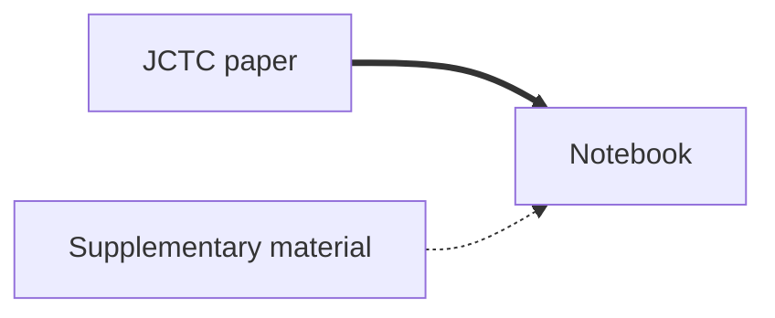

# Alchemical Metadynamics: Adding Alchemical Variables to Metadynamics to Enhance Sampling in Free Energy Calculations

This tutorial will guide you through the process of setting up, performing, and analyzing an alchemical metadynamics simulation using GROMACS with a PLUMED patch.

Below we show the resources you need to fully understand the tutorial, as well as the order in which you should consult them. Each node in the flowchart is clickable and will take you to the corresponding resource. The thick black lines indicate the best path to follow, while the dashed lines indicate supplementary resources that you may find useful.

If you use alchemical metadynamics in your research, please cite the following paper:

Hsu, W. T., Piomponi, V., Merz, P. T., Bussi, G., & Shirts, M. R. (2023). Alchemical metadynamics: Adding alchemical variables to metadynamics to enhance sampling in free energy calculations. *Journal of Chemical Theory and Computation*, 19(6), 1805-1817. doi: [10.1021/acs.jctc.2c01258](https://pubs.acs.org/doi/10.1021/acs.jctc.2c01258)

